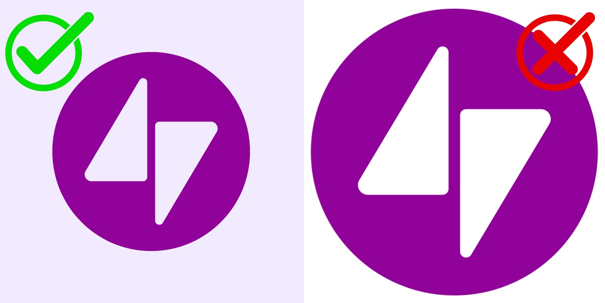

# Contributing To TAC Token List

## Making A Pull Request

Make sure to do the following:
1. Fork this repository
2. Make your changes
3. Run `pnpm validate` to ensure your changes are valid
4. Submit a Pull Request

PLEASE NOTE:
- Submitting a PR _DOES NOT_ guarantee addition to the lists
- All PRs should include relevant assets in the `assets/` directory

### Adding a Token

```json
{
  "chainId": 239,
  "address": "0x0000000000000000000000000000000000000000",
  "symbol": "ACME",
  "name": "ACME Token",
  "logoURI": "https://yourhosting/image/tokenlogo/logo.png",
  "decimals": 6,
  "tags": ["moviecoin", "cartoon"]
}
```

> **NOTE:** If adding an image, give it the same name as the `address`:

_Example:_
```
src/assets/tokens/0x0000000000000000000000000000000000000000.png
```

#### Required Fields:

- `chainId`: Chain ID of the network (`239` for mainnet)
- `address`: Token contract address
- `symbol`: Token symbol
- `name`: Token name
- `logoURI`: Path to token icon
- `decimals`: Token decimal places
- `tags`: Array of tags (as minimum should have the TON Jetton address `jetton:`)

#### TAGS:
- "stablecoin": {
  "name": "Stablecoin",
  "description": "Tokens that are fixed to an external asset, e.g. the US dollar or derivatives of it."
}

- "btc": {
  "name": "Bitcoin Based",
  "description": "Bitcoin derivatives or wrapped versions."
}

- "eth": {
  "name": "$ETH Based",
  "description": "$ETH derivatives or wrapped versions."
}

- "ton": {
  "name": "TON Based",
  "description": "TON derivatives or wrapped versions."
}

- "yieldbearing": {
  "name": "Yield Bearing",
  "description": "Tokens that bear a form of yield"
}

- "ton-native": {
  "name": "TON Native",
  "description": "Tokens that are native to TON and wrapped into erc20"
}

- "tac-native": {
  "name": "TAC Native",
  "description": "Tokens that are native to TAC and mirrored on TON as wrapped Jettons"
}

- "tac-lz-bridged": {
  "name": "TAC LayerZero Bridged",
  "description": "Tokens that are native to other chains, bridged to TAC with LayerZero as OFTs, and are mirrored on TON as wrapped Jettons"
}

- "tac-agg-bridged": {
  "name": "TAC AggLayer Bridged",
  "description": "Tokens that are native to other chains, bridged to TAC with AggLayer, and are mirrored on TON as wrapped Jettons"
}

- "tac-hl-bridged": {
  "name": "TAC HyperLane Bridged",
  "description": "Tokens that are native to other chains, bridged to TAC with HyperLane, and are mirrored on TON as wrapped Jettons"
}

### Asset Guidelines

- Upload assets to the `assets/` directory
- Use PNG or JPG format with solid background (no transparency) - Other formats are not supported
- Size needs to be: 1024x1024 pixels


